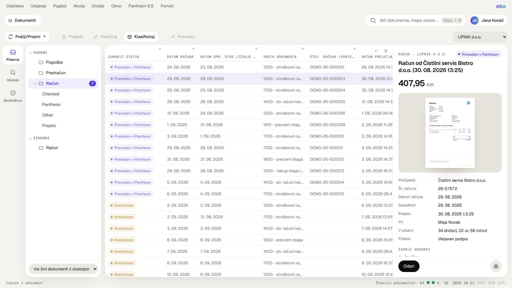
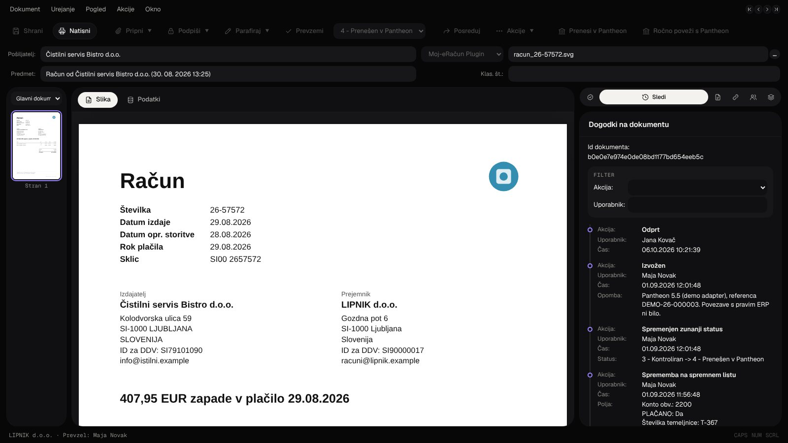
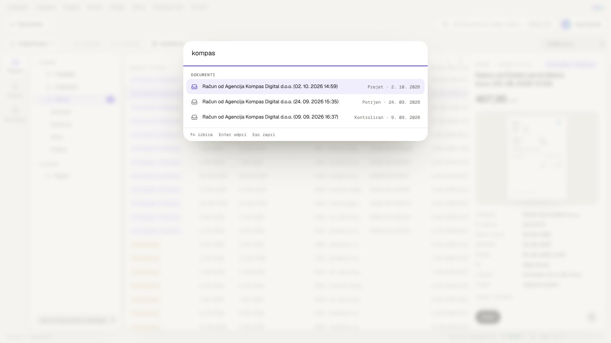
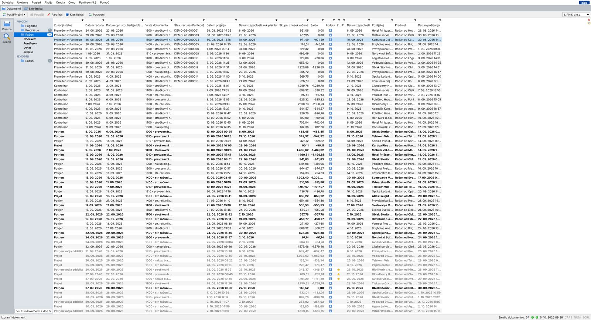
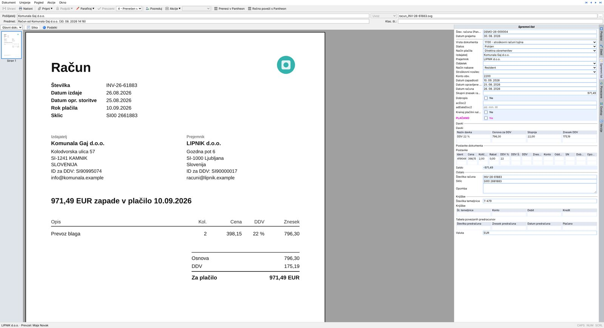
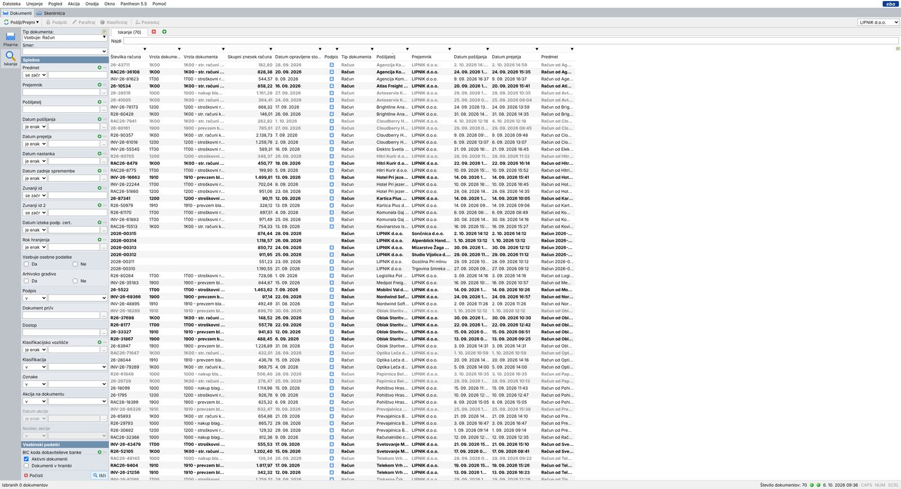
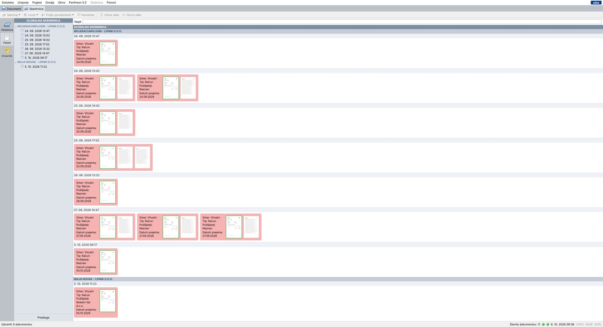

# EBA DMS – local demo recreation

A runnable, local recreation of the **EBA DMS 4.1 Windows desktop client** (Slovenian UI) built from the
capture package `EBA-DMS-Recreation` (screenshots 01–60 and the catalogs). It reproduces the dense desktop
layout, menus, shortcuts, office grids, document window, search, scanning room, supervision, settings and
directory with **fictional data only**, a persistent local store, enforced permissions and demo adapters for
every external integration.

> Independent demo for internal evaluation. Not a product of, nor affiliated with, EBA d.o.o.
> All companies, people, invoices, identifiers and connection settings are invented.
> The original reference screenshots (which contain real business data) are **not** part of this repository.



## Two looks: Sodoben (default) and Klasičen (EBA)

The app opens in a **modern look** modelled on the Photon design language (warm off-white ground, white cards,
Geist type, pill buttons, violet accent, automatic dark mode). The faithful dense **classic EBA look** is one click
away under **Pogled › Videz** (or the user menu); the choice is saved per user. Both looks use the same screens,
menus, shortcuts, permissions and data; the modern look adds a few interaction aids:

- **Predogled dokumenta** – a panel beside the Pisarna and Iskanje lists with the selected document's status,
  amount, first page, key facts and last events, plus *Odpri / Prevzemi / Parafiraj / Posreduj / zaznamek*, so an
  invoice can be checked and approved without opening its window. Multi-select shows the count and total.
  Toggle under Pogled › Predogled dokumenta.
- **Coloured status labels** for the external status (Prejet, Potrjen, Kontroliran, Prenešen v Pantheon).
- **Iskanje ukazov** (Ctrl+Shift+P or `/`) – one box for documents, folders, views and every enabled menu command.
- A cleaner **document window**: segmented Slika/Podatki and panel tabs along the top of the side panel.

| Modern, dark – document window | Command search |
|---|---|
|  |  |

## Quick start

Requirements: **Node.js 20+** (no npm packages are needed to run it).

```bash
cd eba-dms
npm start                 # http://localhost:4173
```

On Windows you can also double-click **`start-eba.cmd`**. It starts the server and opens the app in an Edge app
window, which looks like a desktop window and opens documents in separate windows.
If Node.js is missing, install it with `winget install OpenJS.NodeJS.LTS`.

Log in with one of the demo users (password **`demo`** for all):

| User | Name | Role (company LIPNIK d.o.o. unless noted) | Typical use |
|---|---|---|---|
| `mnovak` | Maja Novak | Sodelavec v oddelku računovodstva (+ LIPNIK TRADE) | Accounting office, scanning room, Pantheon transfer, outgoing invoices |
| `jkovac` | Jana Kovač | Direktor | Approves received invoices (Prevzemi → Parafiraj › Potrdi) |
| `bzorko` | Barbara Zorko | Vodja financ | First-level approval, supervision |
| `nkos` | Nina Kos | Operativna direktorica | Approval, supervision |
| `pzupan` | Peter Župan | Analitik | Read-only access to invoices |
| `tkrajnc` | Tina Krajnc | Zunanji računovodski servis / Računovodja | Sees only invoices explicitly granted to her |
| `ahorvat` | Andrej Horvat | Upravnik in all four companies | Administration, settings, backup, all documents |
| `lmlakar` | Luka Mlakar | JAVOR MG d.o.o. / Računovodstvo | Cross-company isolation demo |
| `egolob` | Eva Golob | JAVOR MG d.o.o. / Direktor | Approvals in the second company |

### Browser-only build (no server)

```bash
npm i -D esbuild
npm run build:standalone   # dist/standalone.html and dist/standalone-preview.html
```

This bundles the same service, access checks and fixtures into one HTML file that runs entirely in the
browser. State is kept in that browser's IndexedDB, and *Pomoč › Ponastavi demo podatke* resets it. Document
windows open inside the page. Downloads, export and printing show a "not available" notice. This build uses
neutral naming ("DMS") from `src/core/brand-neutral.js`, so it can be shared without the original product name;
`--keep-brand` keeps the original labels.

### Reset the demo data

```bash
npm run reset             # rebuilds ./data from the fictional fixtures
node server.mjs --reset   # reset and start
node server.mjs --data ./otherdata --port 8080
```

State lives in `data/state.json` plus immutable files in `data/blobs/`. Every change is written immediately
(atomic temp-file + rename), so reloading the page or restarting the server keeps all changes.

### Tests

```bash
npm test                  # core unit tests + API tests (no dependencies)
npm i -D playwright && npx playwright install chromium
npm run test:e2e          # browser tests (UI behaviour)
npm run screenshots       # captures 2560x1392 and 1366x768 layouts into ./screenshots-out
```

What the tests verify: folder and scope counts come from the data and update after actions; column value filters
(Vsebuje / Ne vsebuje / Počisti) and search operators give the right rows; selected rows open the right
document; cover-sheet, data view and grid values agree; Uveljavi persists and Prekliči discards; director
approval changes the status and routing and adds the expected audit events; unauthorized roles cannot read or
modify restricted documents, through the API or the blob URLs; content edits keep earlier versions; imports
keep the original file bytes and pages; changes survive a server restart; layouts fit at 2560×1392 and
1366×768; in the modern look the command search jumps to folders and finds commands, the preview approves an
invoice without opening it, and the look switch is saved per user.

## What is implemented

| Area | Implemented behaviour |
|---|---|
| **Shell** | Menu bar `Datoteka … Pomoč` with the captured order, icons, separators, shortcuts and enabled/disabled states; Alt mnemonics (including the duplicate **Alt+K** for Akcija/Okno, which cycles like native menus); module strip `Dokumenti` / `Skenirnica`; toolbar `Pošlji/Prejmi, Podpiši, Parafiraj, Klasificiraj, Posreduj`; company selector (`Vsa podjetja` + member companies); icon rail; splitter; status bar with selection text (`Izbran 1 dokument` …), `Število dokumentov`, connection LEDs, clock, CAPS/NUM/SCRL. Pogled › icon size / text beside icons / toolbars change the toolbar. |
| **Pisarna** | Folder tree VHODNI (Pogodbe, Predračun, Račun › Checked/Pantheon/Other/Prejeto) and IZHODNI (Račun) with unread badges; scope picker `Pisarna / Vsi živi dokumenti z dostopom / Prikaži moje zaznamke / Odprema`; category-specific columns; striped rows, bold unread, grey rows for documents outside your office; sorting; column value filters; resizable columns; column chooser **Stolpci** with display masks (saved per user and folder); multi-select (Ctrl/Shift/keyboard); expandable rows for embedded documents; limited-results notice (`Prikazano je omejeno število dokumentov`, set with the `EBA_LIST_LIMIT` environment variable); full context menu (delete, sign, initial, dispatch actions, read/unread, archive, mail/message, clipboard and linking, classify, show in classification, edit access, claim, notes, tags). |
| **Document window** | Opens in its own window. Menus Dokument/Urejanje/Pogled/Akcije/Okno with the captured shortcuts; toolbar Shrani, Natisni, Pripni▾, Podpiši▾, Parafiraj▾ (Potrdi), Prevzemi, external-status selector, Posreduj, Akcije▾, Prenesi v Pantheon, Ročno poveži s Pantheon; header Pošiljatelj / source selector / filename / Predmet / Klas. št.; scope `Glavni dokument / Vloženi in povezani / Samo vloženi`; page thumbnails; **Slika** with fit height/width, zoom, ruler and full screen; **Podatki** with extracted values, image snippets cut from the source page, `Brez slike` rows and the `Spremni list` group. The six right-hand panels are independent of Slika/Podatki: **Podpisi**, **Sledi** (action/user filter), **Spremni list** (editable after Prevzemi; taxes, line items, postings and linked pro forma tables), **Povezave**, **Dostop** (grant/revoke), **Verzije** (view/restore). Previous/next document arrows. |
| **Iskanje** | All 144 criteria from the captured tree (22 general + 122 content), in captured order and spelling, with the captured operator profiles and controls (pickers, Da/Ne, dropdowns); green **+** adds an alternative row, **−** removes it; document-type picker (Vsebuje / Ne vsebuje / Počisti), Smer, Aktivni dokumenti / Dokumenti v hrambi, Počisti / Išči; results tab `Iskanje (N)`, Najdi filter, configurable result columns. |
| **Skrbništvo** | Role selector, overview table (Mapa / Št. dok., VHODNI/IZHODNI/INTERNI, Skupaj = sum) and per-folder grid with Uporabnik and Datum v pisarni; requires the supervise permission. |
| **Skenirnica** | **Obdelava**: batch selector (including Nov paket), document list with page counts, page viewer, intake form (direction, type, sender with directory picker, subject, received date, comment, editable recognised fields with snippets), full **Obdelava** menu: new batch, document without image, attach to previous, delete, scan / scan as / scan pages into document, import / import as (four OCR / per-file variants) / import pages into document, export images, teach template, reset fields, send to users (F4), send directly to user (Ctrl+F4), send to my office (Ctrl+Shift+F4, Shift+F4 also opens), report print/export (CSV), labels, recognise templates (F10), full screen, comment. **Paketi**: GLOBALNA SKENIRNICA tree by source/operator and company, timestamp bands, pink cards with page thumbnails (first outlined green), Najdi, Predloge. **Dnevnik**: criteria, log grid with the captured columns, Dodaj ročni vnos / Zbriši (manual entries only) / Natisni. |
| **Settings** | **Osebne nastavitve**: Nadomeščanje (add/edit/cancel substitutions that really grant office access during the period), Skenirnica preferences (subject/date/OCR defaults are used by intake), Ostalo (three-state boxes, Ponastavi columns). **Nastavitve**: Baza podatkov (connection list with Dodaj/Odstrani/Kopiraj/Preimenuj/Status/Kopiraj na odložišče, connection form, Testiraj povezavo/Posodobi bazo/Ustvari bazo as demo outcomes) and Sistem (proxy radios, environment variables with **Dodaj zakrito**, language, log folder, log level, Pokaži datoteko). Help / V redu / Prekliči / Uveljavi behave as in Windows dialogs. Only administrators can apply application settings. |
| **Imenik podjetij** | Search by name/address/tax number/external ID per own company, the `255/2516 zadetkov`-style counter, external-source search (demo notice), Dodaj / Odstrani / Uredi, Enkratni partner, partner form **Vnos imenika** with the editable contact sub-table. |
| **Other** | Login, Odjava, Zakleni program (password unlock), Izhod, Spremeni geslo, Varnostna kopija (admin: JSON export without secrets), Uvozi nastavitveno datoteko, Export (ZIP with pages, `metapodatki.json` and an optional `.url` shortcut), print document / print list, copy list (TSV) / copy document link, O programu, help (F1). |

## Architecture

```
eba-dms/
  server.mjs              CLI entry (start/reset)
  start-eba.cmd           Windows launcher (Edge app window)
  src/core/               shared by server and browser
    format.js             Slovenian dates/amounts, masks, plural forms
    schema.js             folders, scopes, statuses, 144 search criteria, cover-sheet templates, columns
    page-svg.js           synthetic A4 pages with embedded metadata (demo OCR source)
  src/server/
    http.js               zero-dependency HTTP: sessions, JSON API, uploads, blobs, ZIP export
    store.js              JSON state + blob directory, atomic writes
    access.js             permission model (enforced on every query and command)
    service.js            documents, workflow, rules, versions, events, settings, directory
    intake.js             scanner batches, import, demo OCR, templates, dispatch, intake log
    search.js             criteria evaluation
    adapters.js           demo integration adapters (exchange, Pantheon, mail, registry, database)
    demo-data.js          fictional companies, partners, line items
    fixtures.js           builds the demo database by running the real workflow code
  public/                 vanilla ES-module UI (no build step)
    js/app.js             login, shell, menus, keyboard, module switching
    js/views/*.js         office, search, supervision, document window, scanner, settings/directory
    js/ui/*.js            grid, menus, dialogs, icons (classic + modern line set), preview panel, command search
    css/eba.css           classic EBA look
    css/modern.css        modern look (tokens for light/dark, scoped under body.theme-modern)
  tests/                  node:test unit + API tests, optional Playwright e2e and screenshot capture
```

**Domain model.** Companies → roles (organisational paths such as
`LIPNIK d.o.o./Centrala/Finance/Sodelavec v oddelku računovodstva`) → users. A document has company, category
(Pogodbe/Predračun/Račun), direction, subject, sender/recipient, source, dates, external status, typed metadata
(`fields`, keyed by the schema), tables (taxes, line items, postings, linked pro formas), extracted values with
source regions, pages and attachments (blob references), links/embedded documents, **location** (whose office it
is in) and **access** grants, office history, per-user read state and notes, tags, archive/retention data,
classification, signature/approval records, versions and an append-only event list. Intake batches,
templates, an intake log, partners with contacts, personal settings, application settings and an integration
log complete the model. Cover sheets are driven by per-category templates. Administrators can hide or relabel
fields per company with *Akcije › Uredi predlogo za spremni list*.

**Permissions.** Each role has a matrix *category × action* (`read, edit, initial, sign, forward, reject,
dispatch, archive, delete, classify, grant, tag, pantheon`) plus flags (`supervise, scan, settings, admin,
directory`). Reading needs company membership, the `read` action for the category, and either the document
being in (or granted to) one of the user's holders (user, roles, or holders the user currently substitutes
for) or a supervising/administrator role. Every list, search, blob download, export and command checks this
on the server, so hidden buttons are only a convenience.

**Fixtures.** `fixtures.js` creates the demo database by running the real operations (intake dispatch, claim,
cover-sheet edits, Parafiraj, rules, external status, Pantheon transfer, archive) with a simulated clock. Audit
trails, counts and statuses therefore come from the same code the UI uses. Nothing is hard-coded.

## Workflow implemented (demo rules)

1. **Intake** (Skenirnica or Pošlji/Prejmi): a document is created with events `Nov`, `Prejet`, a demo
   `Podpisan` seal by the scanning-room identity ("Podpisal(a)" card), then `Posredovan` to the chosen users/roles.
   An intake-log entry with a protocol number is written.
2. **Prevzemi** (claim) moves the document from the role office to the user personally and unlocks editing,
   Parafiraj, Posreduj, Zavrni and the Akcije menu in the document window.
3. **Parafiraj › Potrdi** adds a "Potrdi" approval card and event `Parafiran (Potrdi)`, then runs the company's
   routing rules. Rule *Potrjen s strani direktorice - v računovodstvo* sets external status
   `0 - Prejet → 1 - Potrjen`, cover-sheet status `Potrjen`, forwards to *Sodelavec v oddelku računovodstva* and
   records `Izvedeno pravilo`, matching the captured audit trail. A second rule routes first-level approvals
   by *Vodja financ* or *Operativna direktorica* to the director (`2 - Potrjen vodja oddelka`).
4. Accounting can set **Zunanji status** (e.g. `3 - Kontroliran`), edit the cover sheet and **Prenesi v
   Pantheon** (`4 - Prenešen v Pantheon`, demo reference number), then archive (**v hrambo**).
5. **Zavrni** sets status `Zavrnjen` and returns the document to whoever forwarded it.
6. **Outgoing invoices**: preparation → Podpiši (demo) → V odpremo (scope *Odprema*) → Pošlji/Prejmi (demo send) or
   *Prestavi dokument neposredno v izdano* / *Vrni v pripravo*.

## Integration boundaries (all demo adapters)

| Boundary | What the replica does | What it never does |
|---|---|---|
| EBA Exchange / Moj-eRačun / AS2 / IMAP / Microsoft Exchange (**Pošlji/Prejmi**) | Sends the dispatch queue by marking documents `sent` with an explicit demo event; "receives" up to 6 generated e-invoices from a local demo inbox into Skenirnica › Paketi | No network calls; the event says the document was not actually sent |
| Pantheon 5.5 | Transfer assigns a `DEMO-…` reference and status 4; manual link stores your reference; synchronisation commands log a demo notice; *Posodobi/Resetiraj šifrante* stay disabled as captured | No ERP connection is claimed |
| E-mail / document message | Stored in a local outbox, logged | No mail is sent |
| Scanner hardware / OCR | Demo scanner generates a synthetic page; demo OCR reads only pages produced by this app (embedded metadata). Imported PDFs/images are kept byte-for-byte and get no extraction | No TWAIN/WIA, no real OCR |
| Signatures | "Podpisal(a)" and "Potrdi" cards marked as demo records; details state that no certificate or cryptographic check exists | No legal or cryptographic validity is claimed |
| Database / proxy | Connection settings are editable; secrets are masked and never returned to the browser; *Testiraj povezavo* reports a **demo test** | The replica always uses `data/state.json` |
| External partner registry | Shows a "not connected" notice; *Uvozi iz registra tr. računov* disabled with a reason | — |
| Backup | Admin JSON export of the state without secrets | No server-side backup |

The integration log is visible under *Pošlji/Prejmi ▾ › Dnevnik integracij* and *Nastavitve › Sistem › Pokaži datoteko*.

## Assumptions for behaviour that was not captured

These are implementation choices, not claims about EBA internals:

- **External status codes** `2 - Potrjen vodja oddelka`, `3 - Kontroliran`, `4 - Prenešen v Pantheon` (only `0` and `1` were observed with numbers).
- **Invoice sub-folders** Checked/Pantheon/Other/Prejeto are saved views over the external status (3 / 4 / 1–2 / 0).
- **Folder badges** count *unread documents in your office* for that folder; grid rows outside your office are grey, unread rows bold.
- **Za / Pri** columns are *Zaznamek* (yellow star = your note, blue star = "forwarded to you" marker) and *Priponka* (attachment).
- **Search**: rows of the same criterion are OR-ed, different criteria AND-ed; empty values are ignored except for *je prazen / ni prazen*; text is case-insensitive; *ni enak* also matches empty values; dates compare by calendar day; amounts numerically. *Datum naročila (dobaviteljeva)* keeps its captured text operators and *Številka naročila (dobaviteljeva)* its comparison operators with a value picker. *Datum akcije* and *Nosilec akcije* become active once *Akcija na dokumentu* has a value and constrain the same event.
- **Versions** are created for document *content* changes (Spreminjanje dokumenta, Pripni, Prilepi priponko, restore). Cover-sheet changes are recorded as `Sprememba na spremnem listu` events with the previous values stored. This matches the captured invoice, which had cover-sheet events and an empty Verzije panel.
- **Event labels without a capture** (marked in `schema.js`): `Prevzet`, `Zavrnjen`, `Vzet iz hrambe`, `Izbrisan`, `Nova verzija`, `V odpremo`, `Izdan`, `Vrnjen v pripravo`.
- **Pošlji/Prejmi ▾** offers *Pošlji/Prejmi* and *Dnevnik integracij*; icon-size / text / toolbar submenus and the *Jezik* list are reasonable guesses (only Slovenščina is active).
- **Pro forma and contract cover sheets**, the classification plan, tags, departments, cost carriers and document-type codes are fictional demo configuration.
- **"Uvozi kot"** asks for the document type after choosing one of the four captured variants.
- **Dispatch from Skenirnica** sends the whole batch by default; the dialog can limit it to the selected document.
- **Unknown controls** (the blank combo in the document toolbar, the narrow `Šif` log column) are shown disabled or empty with a tooltip instead of invented behaviour.

## Known limitations

- Runs in a browser: the Windows title bar is the browser/app window's own. In a normal browser tab **Ctrl+W** and **Ctrl+Q** may close the tab. Use the Edge app window (`start-eba.cmd`) for the closest desktop behaviour.
- PDF pages are shown with the browser's PDF viewer (no per-page thumbnails or snippets for PDFs).
- Folder paths in scanner preferences are stored but have no effect (the browser uploads files; originals are never moved or renamed).
- Single-node local store intended for demos, not concurrent production use.
- Help content is a short in-app summary plus this README.
- The modern look loads the Geist typeface from Google Fonts; offline it falls back to the system UI font.

## Screenshots (fictional data, classic look)



| Document window | Search | Scanning room – batches |
|---|---|---|
|  |  |  |
